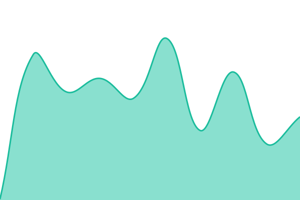
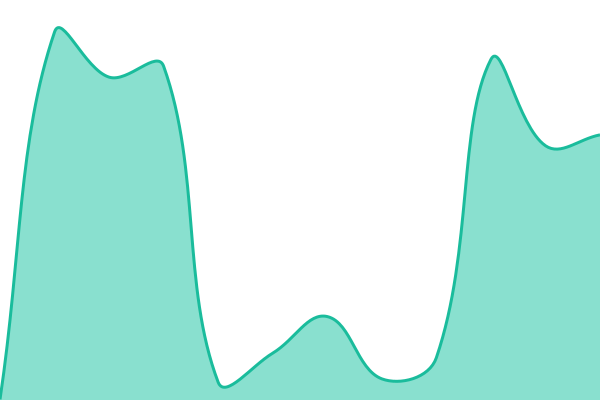
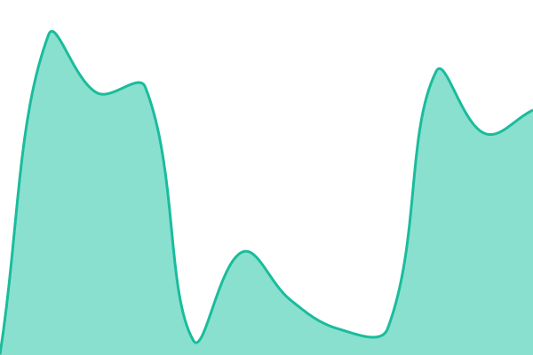
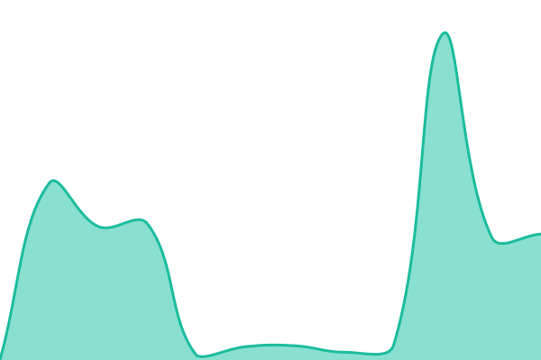
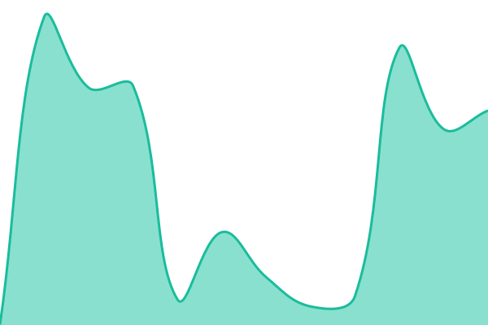
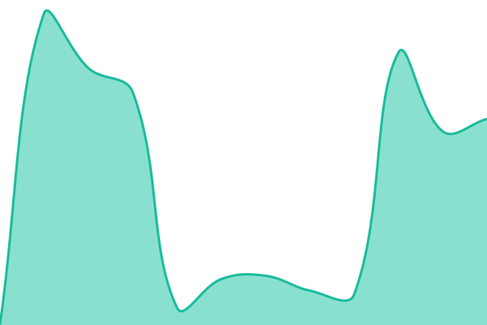
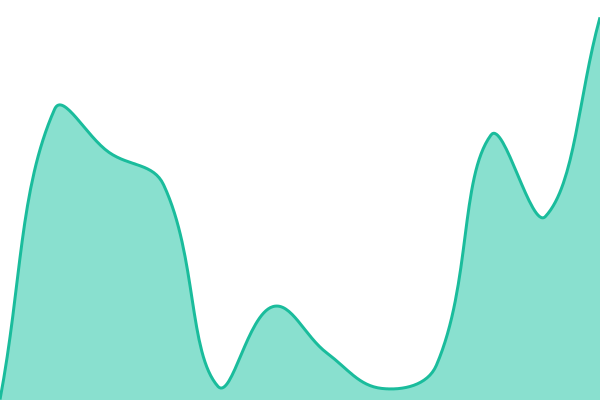
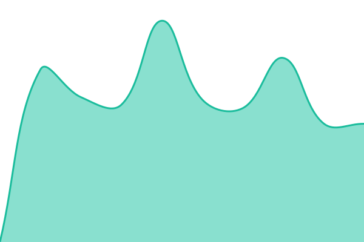

# [📈 Live Status](https://Gelaxiz.github.io/upptime): <!--live status--> **🟧 Partial outage**

This repository contains the open-source uptime monitor and status page for [kela](https://Gelaxiz.github.io/upptime), powered by [Upptime](https://github.com/upptime/upptime).

With [Upptime](https://upptime.js.org), you can get your own unlimited and free uptime monitor and status page, powered entirely by a GitHub repository. We use [Issues](https://github.com/Gelaxiz/upptime/issues) as incident reports, [Actions](https://github.com/Gelaxiz/upptime/actions) as uptime monitors, and [Pages](https://Gelaxiz.github.io/upptime) for the status page.

<!--start: status pages-->
<!-- This summary is generated by Upptime (https://github.com/upptime/upptime) -->
<!-- Do not edit this manually, your changes will be overwritten -->
<!-- prettier-ignore -->
| URL | Status | History | Response Time | Uptime |
| --- | ------ | ------- | ------------- | ------ |
|  [Gelaxiz main site](https://gelaxiz.xyz) | 🟩 Up | [gelaxiz-main-site.yml](https://github.com/Gelaxiz/upptime/commits/HEAD/history/gelaxiz-main-site.yml) | 

 151ms
     
 | 

<a href="https://Gelaxiz.github.io/upptime/history/gelaxiz-main-site">100.00%</a>
    

|  [Nullhost](https://nullhost.cc) | 🟥 Down | [nullhost.yml](https://github.com/Gelaxiz/upptime/commits/HEAD/history/nullhost.yml) | 

 472ms
     
 | 

<a href="https://Gelaxiz.github.io/upptime/history/nullhost">89.67%</a>
    

|  [Media downloader](https://yt.gelaxiz.xyz) | 🟥 Down | [media-downloader.yml](https://github.com/Gelaxiz/upptime/commits/HEAD/history/media-downloader.yml) | 

 468ms
     
 | 

<a href="https://Gelaxiz.github.io/upptime/history/media-downloader">89.68%</a>
    

|  [Docs](https://docs.gelaxiz.xyz) | 🟥 Down | [docs.yml](https://github.com/Gelaxiz/upptime/commits/HEAD/history/docs.yml) | 

 775ms
     
 | 

<a href="https://Gelaxiz.github.io/upptime/history/docs">89.68%</a>
    

|  [First Drop song guesser](https://song.gelaxiz.xyz) | 🟥 Down | [first-drop-song-guesser.yml](https://github.com/Gelaxiz/upptime/commits/HEAD/history/first-drop-song-guesser.yml) | 

 466ms
     
 | 

<a href="https://Gelaxiz.github.io/upptime/history/first-drop-song-guesser">89.68%</a>
    

|  [Fluxer](https://fchat.gelaxiz.xyz) | 🟥 Down | [fluxer.yml](https://github.com/Gelaxiz/upptime/commits/HEAD/history/fluxer.yml) | 

 437ms
     
 | 

<a href="https://Gelaxiz.github.io/upptime/history/fluxer">45.38%</a>
    

|  [Sharkord](https://chat.gelaxiz.xyz) | 🟥 Down | [sharkord.yml](https://github.com/Gelaxiz/upptime/commits/HEAD/history/sharkord.yml) | 

 452ms
     
 | 

<a href="https://Gelaxiz.github.io/upptime/history/sharkord">89.69%</a>
    

|  [File browser](https://files.gelaxiz.xyz) | 🟥 Down | [file-browser.yml](https://github.com/Gelaxiz/upptime/commits/HEAD/history/file-browser.yml) | 

 485ms
     
 | 

<a href="https://Gelaxiz.github.io/upptime/history/file-browser">89.69%</a>
    

|  [Raw files](https://rawfiles.gelaxiz.xyz) | 🟥 Down | [raw-files.yml](https://github.com/Gelaxiz/upptime/commits/HEAD/history/raw-files.yml) | 

 464ms
     
 | 

<a href="https://Gelaxiz.github.io/upptime/history/raw-files">89.69%</a>
    

|  [Web proxy](https://www-proxy.gelaxiz.xyz) | 🟩 Up | [web-proxy.yml](https://github.com/Gelaxiz/upptime/commits/HEAD/history/web-proxy.yml) | 

 943ms
     
 | 

<a href="https://Gelaxiz.github.io/upptime/history/web-proxy">100.00%</a>
    

|  [Netlify mirror](https://netlify.gelaxiz.xyz) | 🟩 Up | [netlify-mirror.yml](https://github.com/Gelaxiz/upptime/commits/HEAD/history/netlify-mirror.yml) | 

 753ms
     
 | 

<a href="https://Gelaxiz.github.io/upptime/history/netlify-mirror">100.00%</a>
    

<!--end: status pages-->

[**Visit our status website →**](https://Gelaxiz.github.io/upptime)

## 📄 License

- Powered by: [Upptime](https://github.com/upptime/upptime)
- Code: [MIT](./LICENSE) © [Anand Chowdhary](https://anandchowdhary.com)
- Data in the `./history` directory: [Open Database License](https://opendatacommons.org/licenses/odbl/1-0/)
